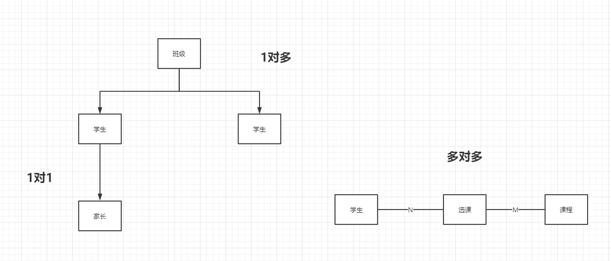

# 简介
sequelize orm模型使用demo

## 使用
```bash
npm i

npm run test
```

## 更新记录
### [2018-12-25]
1. 创建sequelize实例
2. 创建 2张表，关系为1对多
3. 循环遍历文件夹，创建model对象
4. 通过sync方法，在mysql中创建表
5. 添加sequlize配置文件,添加sequelize-auto模块使用方法

### [2018-12-26]
1. 添加dao实例对象，用来操作model。
2. 添加测试用例

### [2019-1-2]
1. 修改model，创建新的teacher,student和classroom表
2. 添加单元测试启动指令

表间关系为：


### [2019-1-3]
1. 添加 和学生表为1对1关系的家长表
2. 添加批量创建方法
3. 重写单元测试，使用power-assert

### [2019-1-13]
1. 添加初始化数据单元测试
2. 引入random生成随机数
3. 添加使用 controllers 参数的验证
